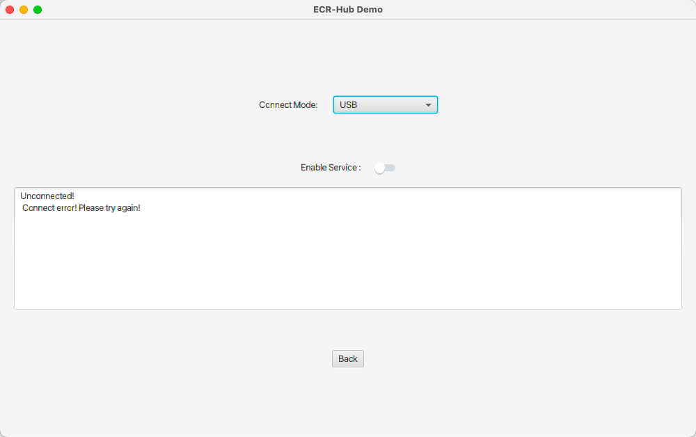
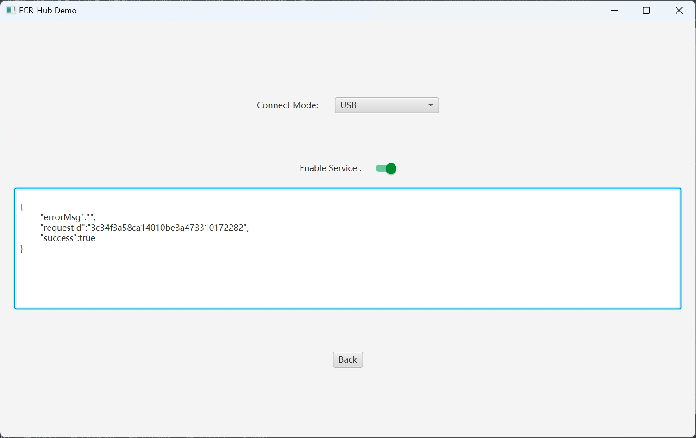
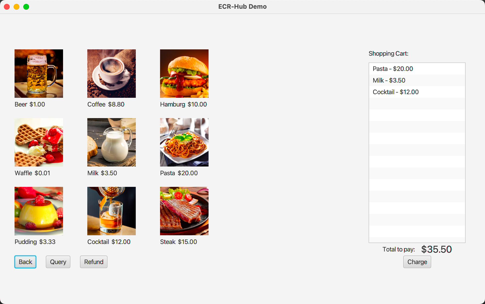
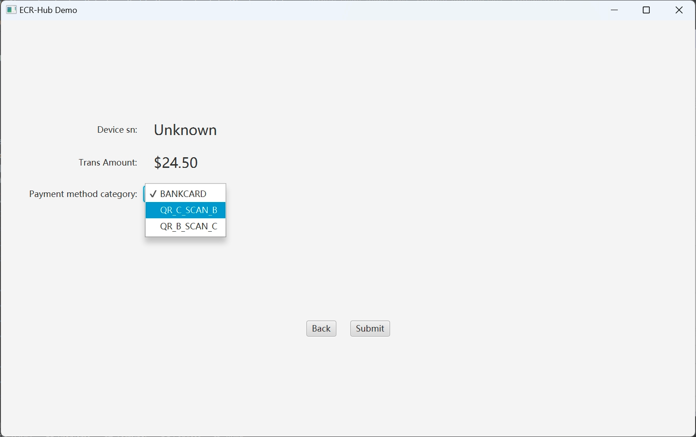
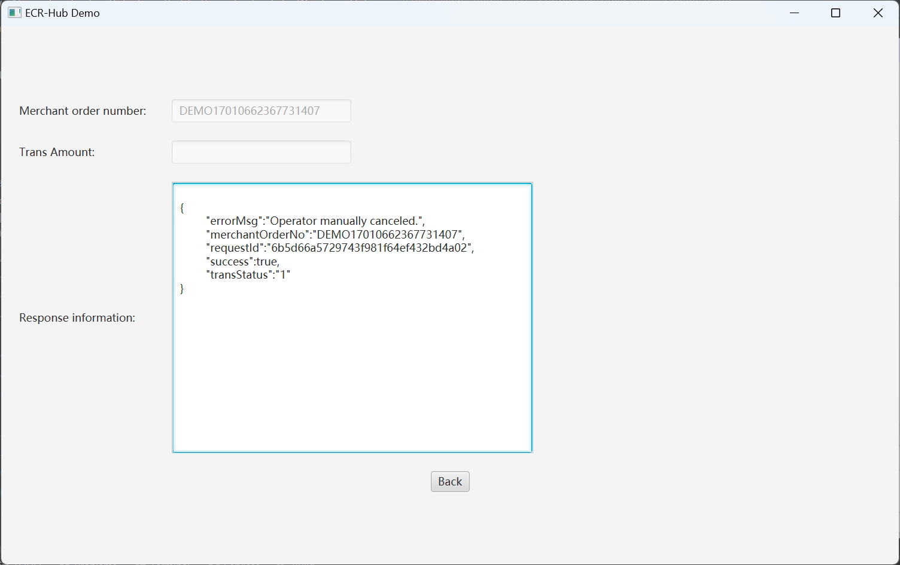
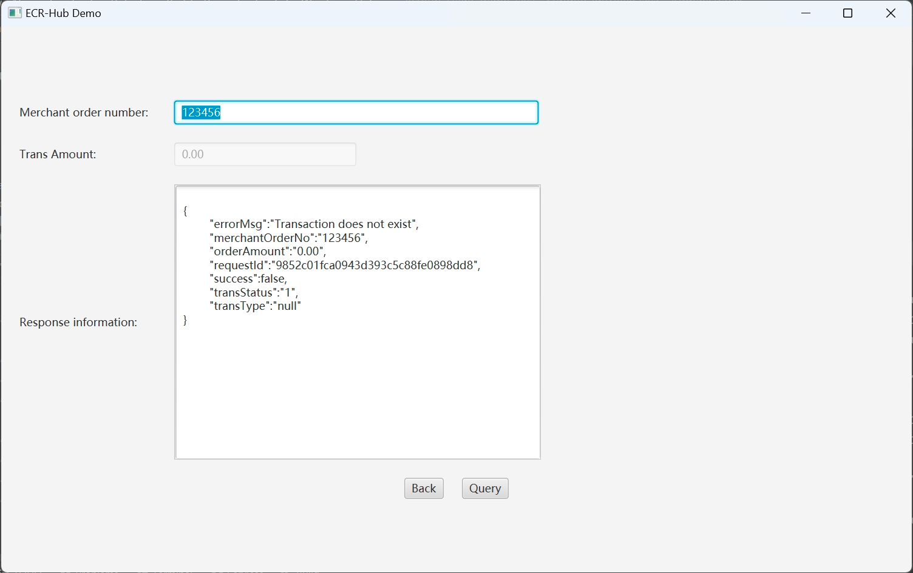
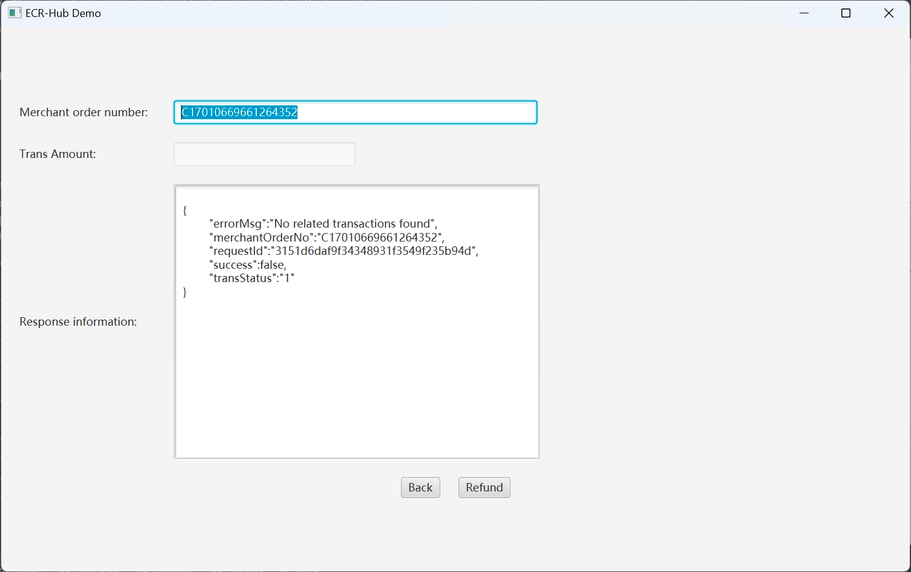

# ECR-Hub Demo

## Version 1.0.1

ECR-Hub Demo version 1.0.1 introduces three major features, enhancing the experience of device connection, demo demonstrations, and simulated transactions. Users can easily connect devices, and simulate transactions.

## Running the ECR-Hub Demo

## New Features

### 1. Setting

#### USB Connection Mode
- Choose USB connection mode by clicking the "Enable Service" button.
- Real-time feedback, including success and failure messages, is displayed at the bottom.
  

#### WLAN/LAN Connection Mode
- Switch to WLAN/LAN mode by clicking the "Enable Service" button to start listening.
- The left side displays connectable devices in the current network with options for refreshing (`Refresh`) and pairing (`Pairing`).
- The right side displays already paired devices with options to connect (`Connect`), disconnect (`Disconnect`), and unpair (`Unpairing`).
  

### 2. Shopping

- Connect the device to simulate transactions.
- Choose products on the first screen, click "Charge" to enter the confirmation screen.

- Select the device and transaction type, click "Submit" to trigger the device to send a request.

- The transaction result is displayed in real-time on the screen.

- Click the "Query" button to navigate to the order query page for order details. 

- Click the "Refund" button to navigate to the refund page. Input the order number for refund processing.

## Other Changes

- Updated project documentation, providing detailed usage instructions.

## Links

- [Download this version](https://github.com/paycloud-open/ecrhub-client-demo-java/releases/tag/v1.0.0)
- [Project documentation](https://github.com/paycloud-open/ecrhub-client-demo-java)

Released on November 24, 2023